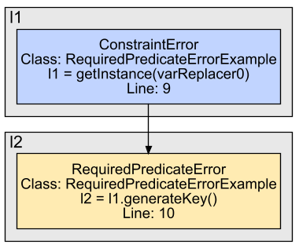

# Error Types

CryptoAnalysis reports various kinds of errors that violate the sections in a CrySL rule. On this page, we give an overview and examples of the different error types. Note that the examples contain simple rules and programs to emphasize the concrete violation, they may not be part of the actual ruleset.

## General information

CryptoAnalysis operates on an intermediate representation (three address code) of the original code. Therefore, the reported statements may be simplified and variable names may differ. To compensate for these deviations, CryptoAnalysis reports among the error types the classes, statements and line numbers of the error location. Hence, one should be able to find the exact error locations in the original code.

Additionally, CryptoAnalysis performs small transformations on the original code. Primarily, this step includes extracting direct parameters into multiple statements. For example, the statement

```java
KeyGenerator kg = KeyGenerator.getInstance("AES", "BC");
```

is transformed to

```shell
varReplacer0 = "AES";
varReplacer1 = "BC";
kg = KeyGenerator.getInstance(varReplacer0, varReplacer1);
```

Depending on the error type, CryptoAnalysis may report an error at the first two statements, although these statements do not exist in this form in the original code. Using the reported line numbers, one can map the statement to the original statement because the line numbers are kept from the original code. These transformations can be identified by the `varReplacer` name.

## ConstraintError

CryptoAnalysis reports a `ConstraintError` if a constraint from the `CONSTRAINTS` section is violated. For example, consider the following rule `KeyGenerator.crysl`:
```
SPEC javax.crypto.KeyGenerator

OBJECTS
    java.lang.String algorithm;
    int keySize;

EVENTS
    Ins: getInstance(algorithm);
    Init: init(keySize);

CONSTRAINTS
    algorithm in {"AES"} => keySize in {128, 256};
```
and the following program that violates the constraint
```java

public class ConstraintErrorExample {
    
    public static void main(String[] args) {
        KeyGenerator keyGen = KeyGenerator.getInstance("AES");
        keyGen.init(64); // Key size of 64 is not allowed
    }
}
```
CryptoAnalysis reports a `ConstraintError` indicating that the constraint from the rule is violated. Note that the constraint is evaluated as a logical expression `A => B` that is violated when `A` is satisfied and `B` is violated. Depending on the constraints and the logical expressions, the error messages may vary.

## ForbiddenMethodError
CryptoAnalysis reports a ForbiddenMethodError if there is a call to method from the FORBIDDEN section. For example, consider the following rule `PBEKeySpec.crysl`:
```
SPEC javax.crypto.spec.PBEKeySpec

FORBIDDEN
    PBEKeySpec(char[]);
```
and the program
```java
public class ForbiddenMethodErrorExample {

    public static void main(String[] args) {
        byte[] password = new byte[]{'p', 'w', 'd'};
        PBEKeySpec spec = new PBEKeySpec(password); // This constructor call is forbidden
    }
}
```
CryptoAnalysis reports a `ForbiddenMethodError` because the rule does not allow the call to the constructor that has only `char[]` as parameter.

## ImpreciseValueExtractionError

CryptoAnalysis reports an `ImpreciseValueExtractionError` if it is not able to extract required information to evaluate constraints from the `CONSTRAINTS` section. For example, consider the following rule `KeyGenerator.crysl`:
```
SPEC javax.crypto.KeyGenerator

OBJECTS
    java.lang.String algorithm;

EVENTS
    Con: getInstance(algorithm);

CONSTRAINTS
    algorithm in {"AES"};
```
and the program
```java
public class ImpreciseValueExtractionError {
    
    public static void main(String[] args) {
        String alg = readFromInput(); // Assumption: readFromInput() returns some dynamic input
        KeyGenerator keyGen = KeyGenerator.getInstance(alg);
    }
}
```

CryptoAnalysis reports a `ImpreciseValueExtractionError` for the constraint `algorithm in {"AES"}` because it cannot statically evaluate the return value of `readFromInput()`.

## IncompleteOperationError

CryptoAnalysis reports an `IncompleteOperationError` if the operations in the `ORDER` sections are not completed. For example, consider the following rule `KeyGenerator.crysl`:
```
SPEC javax.crypto.KeyGenerator

EVENTS
    Con: getInstance(_);
    Init: init(_);
    Gen: generateKey();

ORDER
   Con, Init, Gen
```
and the program
```java
public class IncompleteOperationErrorExample {
    
    public static void main(String[] args) {
        KeyGenerator kg = KeyGenerator.getInstance("AES");
        kg.init(128);
    }
}
```
CryptoAnalysis reports an `IncompleteOperationError` because a call to `generateKey()` is missing to complete the sequence of operations in the `ORDER` section. In this example, the incomplete operation renders the code dead because the `KeyGenerator` is initialized but not used.

## TypestateError

CryptoAnalysis reports a `TypestateError` if the order of operations in the `ORDER` section is violated. For example, consider the following rule `KeyGenerator.crysl`:
```
SPEC javax.crypto.KeyGenerator

EVENTS
    Con: getInstance(_);
    Init: init(_);
    Gen: generateKey();

ORDER
    Con, Init, Gen
```
and the program
```java
public class TypestateErrorExample {
    
    public static void main(String[] args) {
        KeyGenerator kg = KeyGenerator.getInstance("AES"); // Con
        // Missing call to kg.init(...)
        Key key = kg.generateKey(); // Gen
    }
}
```
CryptoAnalysis reports a `TypestateError` because the call sequence misses the event `Init` that is defined with a call to `init(...)`.

## RequiredPredicateError
CryptoAnalysis reports a `RequiredPredicateError` if a predicate from the `REQUIRES` section is not ensured. For example, consider the following rules `KeyGenerator.crysl`
```
SPEC javax.crypto.KeyGenerator

OBJECTS
    java.lang.String algorithm;
    java.security.Key key;

EVENTS
    Con: getInstance(algorithm);
    Gen: key = generateKey(); // Define the return value from the call to generateKey()

ORDER
    Con, Gen

CONSTRAINTS
    algorithm in {"AES"};

ENSURES
    generatedKey[key]; // If the KeyGenerator is secure, it ensures the predicate 'generatedKey' on the returned value 'key'
```
and `Key.crysl`
```
SPEC java.security.Key

REQUIRES
    generatedKey[this]; // A key requires the predicate 'generatedKey' when it is instantiated (this)
```
and the program
```java
public class RequiredPredicateErrorExample {
    
    public static void main(String[] args) {
        KeyGenerator kg = KeyGenerator.getInstance("DES"); // "DES" causes a ConstraintError, i.e. the rule is violated and kg not secure and cannot ensure any predicates
        Key key = kg.generateKey(); // kg does not ensure a predicate on the key such that the required predicate 'generatedKey' is violated in the rule Key.crysl
    }
}
```
CryptoAnalysis reports a `RequiredPredicateError` because the algorithm DES is not allowed such that the rule for the KeyGenerator is violated and kg is not secure. Therefore, kg does not ensure any predicates which violates the `REQUIRES` section from the rule `Key.crysl`.
Note that CryptoAnalysis also reports a `ConstraintError` for the violated algorithm constraint and connects it to the `RequiredPredicateError`. In this scenario, the `ConstraintError` causes the `RequiredPredicateError` and we have the following connection:



Note that CryptoAnalysis operates on the intermediate representation of the original program code. Hence, the variable names may differ. In this case, `l1` corresponds `kg` and `l2` corresponds to `key`.

## AlternativeRequiredPredicateError
CryptoAnalysis reports an `AlternativeRequiredPredicateError` if a predicate with alternatives from the `REQUIRES` section is not ensured. Conceptually, this error is the same as a `RequiredPredicateError`. The difference is that CryptoAnalysis reports an `AlternativeRequiredPredicateError` if no alternatives are ensured. For example, we have the following rule `Cipher.crysl`
```
SPEC javax.crypto.Cipher

OBJECTS
    java.security.Key key;

EVENTS
    Con: getInstance(_);
    Init: init(_, key);

REQUIRES
    generatedKey[key] || generatedPubKey[key] || generatedPrivKey[key]; // Alternatives: key is a (symmetric) key, public key or private key
```
An `AlternativePredicateError` indicates that no alternative is ensured, i.e. a given key is not a correctly generated symmetric, public or private key.
