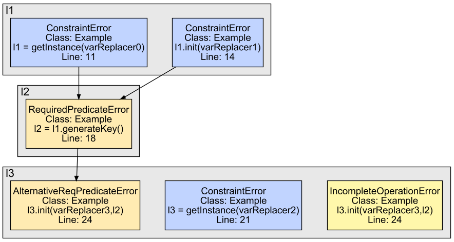

# Example Analysis

To show how CogniCrypt<sub>SAST</sub> works, we consider the following code example:

```java
import java.security.GeneralSecurityException;
import javax.crypto.KeyGenerator;
import javax.crypto.SecretKey;
import javax.crypto.spec.SecretKeySpec;
import javax.crypto.Cipher;

public class Example {

    public static void main(String[] args) throws GeneralSecurityException {
        // "DES" is not allowed -> ConstraintError
        KeyGenerator generator = KeyGenerator.getInstance("DES"); // l1

        // Key size of 64 is not allowed -> ConstraintError
        generator.init(64);

        // KeyGenerator is not correctly initialized. Hence, the generated
        // key is not secure -> RequiredPredicateError
        SecretKey key = generator.generateKey(); // l2

        // "DES" is not allowed -> ConstraintError
        Cipher cipher = Cipher.getInstance("DES"); // l3

        // "key" is not securely generated -> RequiredPredicateError
        cipher.init(Cipher.ENCRYPT_MODE, key);

        // Cipher object is initialized but not used for encryption -> IncompleteOperationError
    }
}
```

Using the [JCA rules](https://github.com/CROSSINGTUD/Crypto-API-Rules/tree/master/JavaCryptographicArchitecture/src), we can use the `HeadlessJavaScanner` to analyze the compiled version of this program:

```
java -jar HeadlessJavaScanner-x.y.z-jar-with-dependencies.jar \\
               --appPath ./Example.jar \\
               --rulesDir ./JCA-CrySL-rules.zip \\
               --framework Soot \\
               --reportFormat CMD \\
               --reportPath ./output/ \\
               --visualization
```
Observe that we use `Soot` as the underlying analysis framework, we print the report to the command line, and we enable the visualization. CogniCrypt<sub>SAST</sub> runs the analysis and prints a report to the command line. In total, it reports 3 ConstraintErrors, 2 RequiredPredicateErrors and 1 IncompleteOperationError, and their positions in the original programs. Additionally, since we use `--visualization`, it creates the following image `visualization.png` in the directory `./output/`:



You can see that two ConstraintErrors on the object `l1` (KeyGenerator) cause a RequiredPredicateError on the object `l2` (SecretKey) which in turn causes a RequiredPredicateError on the object `l3` (Cipher). Additionally, there is another ConstraintError and IncompleteOperationError on the Cipher object. Note that the variables and statements correspond to the intermediate representation Jimple. You can match the variables to the command line output that lists all analyzed objects.
